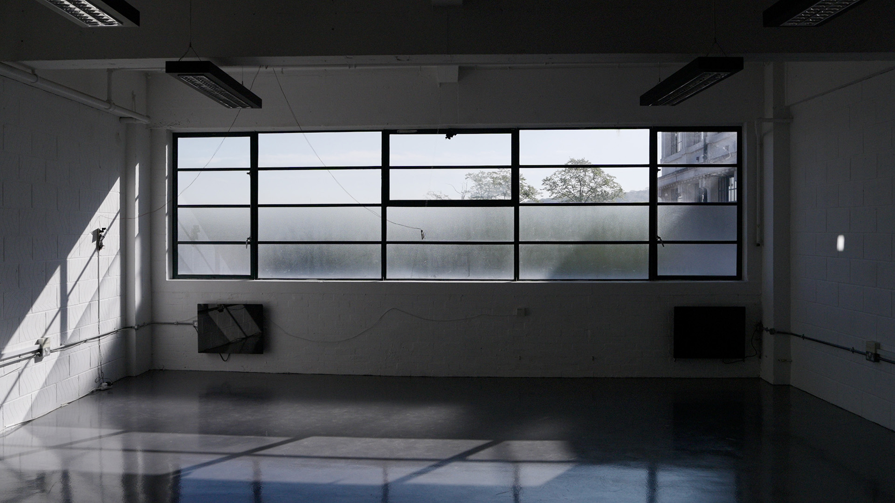
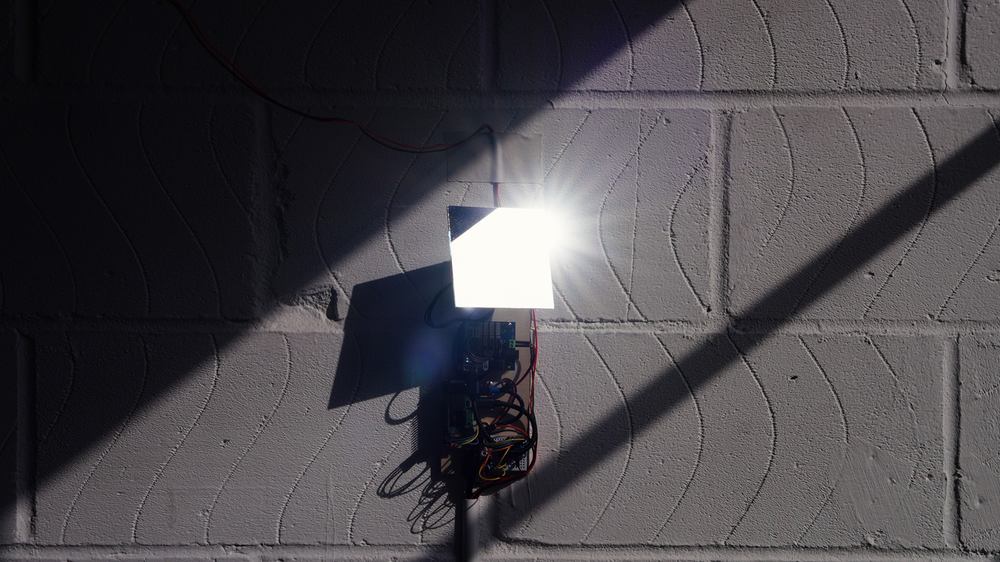

# Mediating Solar Time

> What would a world look like if we allowed our environment to control our machines?

A solar-tracking mirror installation by Paul Calver.

## About

A mirror redirects sunlight onto the solar panel that powers it. When it finds alignment, the system sustains itself. When it doesn't, it waits.

A solar panel belongs outside, in the sun. This one is indoors, by design. The system has chosen the hard way, on purpose, for its own reasons.

## Technical notes

Raspberry Pi, Dynamixel XL-330 servos, ADS1115 voltage reader, 5W indoor solar panel. Python control loop: if voltage is low, search; if voltage is high, hold. The system is light-seeking, not astronomically calculated.

## Inspiration

Tega Brain's *Solar Protocol* asks what happens when environments control machines rather than the other way round. Quiet Ensemble's *SOLE*, which simulates a sun using forty-nine projectors, reflects on how our experience has become mediated by invisible technology — this piece shares that concern but approaches it from the opposite direction, using technology to redirect the actual sun. Eliasson and Turrell show how celestial forces can be staged at architectural scale. This piece works much smaller — domestic in scale, celestial in logic.

## Author

Paul Calver, April 2026.
pcalv001@gold.ac.uk
